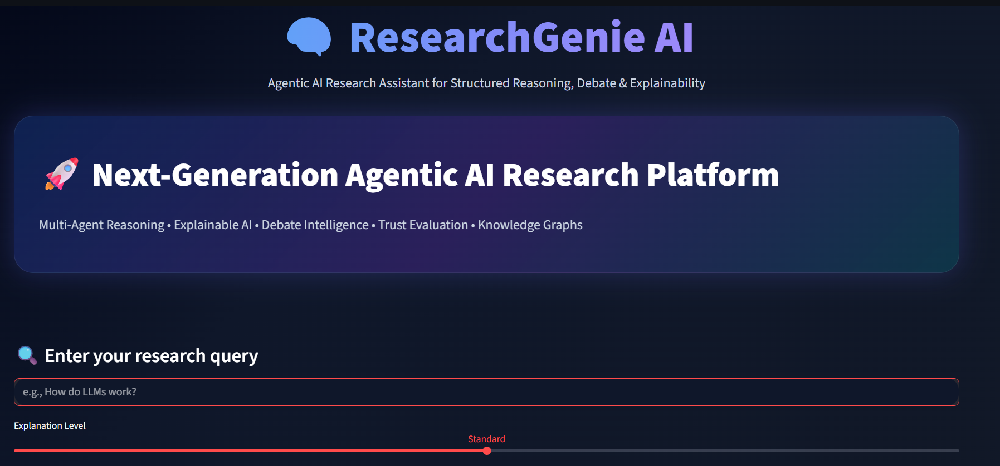
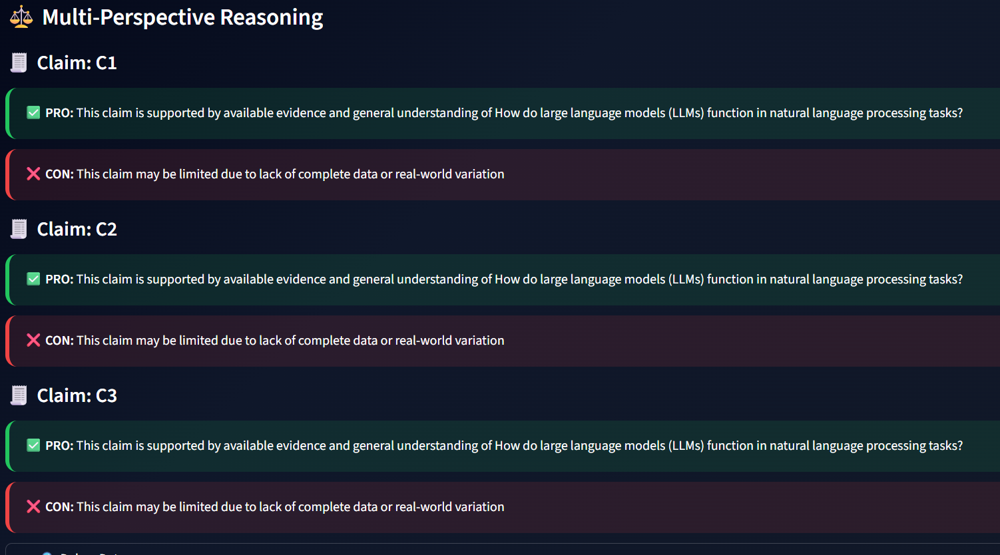
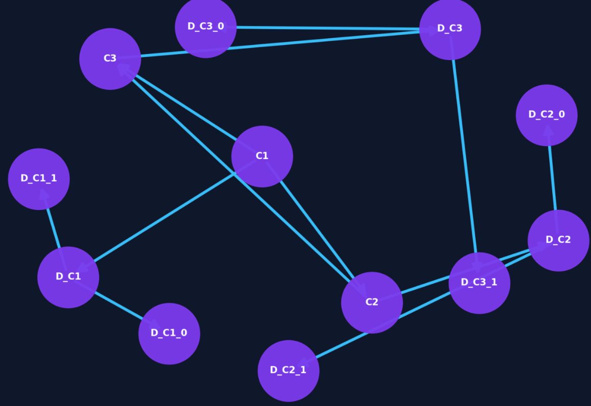

# ResearchGenie AI

## Agentic AI Research Assistant for Structured Reasoning & Explainability

ResearchGenie AI is a modular multi-agent AI system designed for:
- structured reasoning
- explainable AI
- trust evaluation
- uncertainty analysis
- semantic plagiarism detection
- knowledge graph visualization

---

# Features

- Multi-Agent Architecture
- PRO-CON Debate Reasoning
- Trust Score Evaluation
- Semantic Plagiarism Detection
- Explainable Knowledge Graphs
- Uncertainty Classification
- Interactive Streamlit Dashboard
- Local LLM Inference using Ollama

---

# Tech Stack

- Python
- Streamlit
- Ollama
- Mistral-7B-Instruct
- Sentence Transformers
- NetworkX
- Matplotlib

---

# Screenshots

## Dashboard


## Knowledge Graph


## Trust Analysis


---

# Installation

```bash
git clone YOUR_REPOSITORY_LINK
cd ResearchGenie-AI
pip install -r requirements.txt
streamlit run ui.py
```

# Future Scope

- Retrieval-Augmented Generation (RAG)
- Live Web Research
- Citation Generation
- Long-Term Memory

# Team Members

VIKAS KUMAR S
MAHIDHAR REDDY
M SUSANTH

# Demo Video

(https://youtu.be/MTgcHYfEIj8)